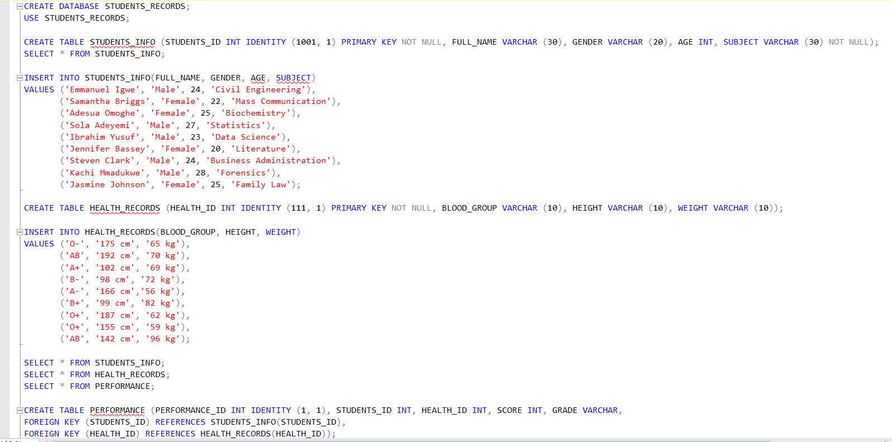
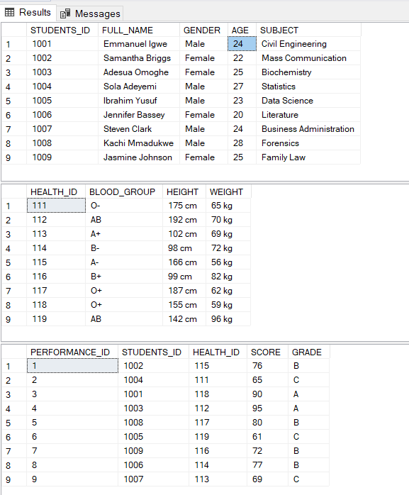
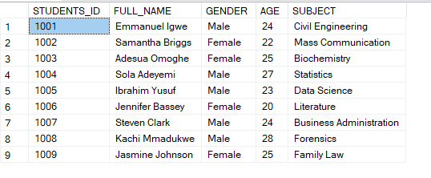
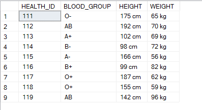
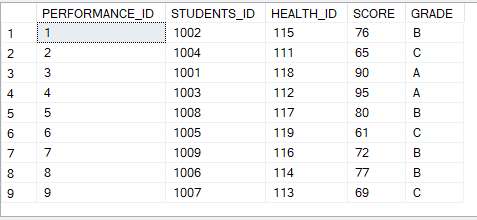

# The Exciting World of Queries.

## Introduction
This project showcases my dive into the world of Queries using the Structured Query Language (SQL). As a data analyst, enthusiastic about learning and taking on projects, this shows the depth of my learning and progress. 

**_Disclaimer_** ⚠️- _All data used for this analysis are hypothetical data generated and do not represent any company's data or an attempt to endanger their performance._

## Problem Statement
In this project, in a bid to thoroughly advance in the world of SQL, I worked on the following tasks:
- Creating a Database named "Students_Record"
- Creating a Student Info Table with Primary Keys
- Creating a Health Record Table with Primary Keys
- Creating a Performance Table with Foreign Keys
- Use of SELECT functions
- Modification and Altering of tables.

## Skills Demonstrated
In this project, I showcased my ability to create a database and create different tables in the same database. Skills demonstrated in this project include: Database creation, table creation and modification, and use of constraints like primary key, foreign key and not null. 

## Data Sourcing
The data was created from scratch by me. The details used were hypothetically generated by me.

## SQL Fundamentals and Analysis

 - A database named Students_Records was created and three tables, namely, Students_info, Health_records and Performance were created and appropraite values inserted into them.
 - The students_info and health_records tables were both given the primary key constraint to their ID columns, and a constraint that does not allow null values.
 - The Performance table was given the foreign key constraint.
 - The tables were created and executed successfully.

                                               |                                         
:---------------------------------------------------------------------:|:-----------------------------------------------------------------------------------------:

                             |                                      |                        |
:-------------------------------------------------:|:---------------------------------------------------------:|:-------------------------------------------------:

## Conclusion

My SQL journey has been an intriquing and exciting one. The world of queries is a very technical one and I believe will bring out the best in me as an analyst. Working on this project has prompted me to keep trying my hands on more and more tasks. The more challenging, the better. 

"Excellence is an art won by training and habituation. We do not act rightly because we have virtue or excellence, but rather we have those because we have acted rightly. We are what we repeatedly do. Excellence, then, is not an act but a habit." - Aristotle

# Thank You! 🙏

